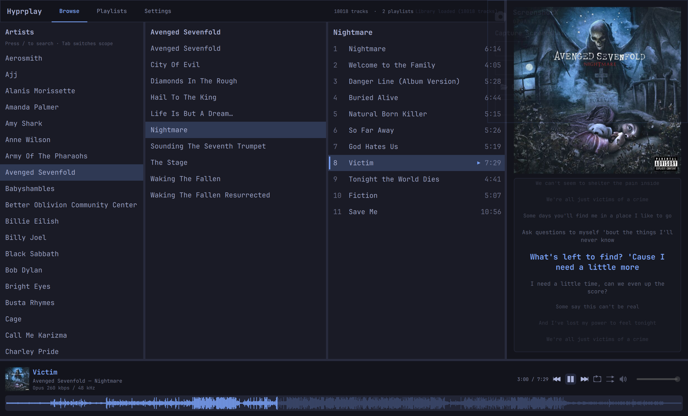
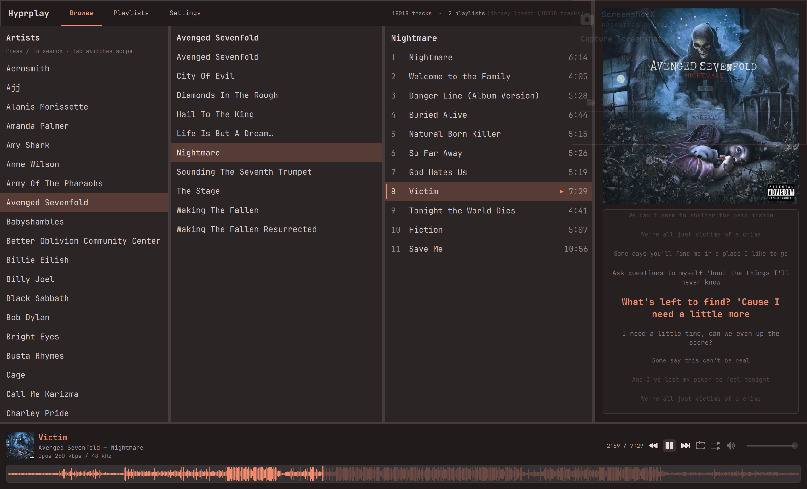
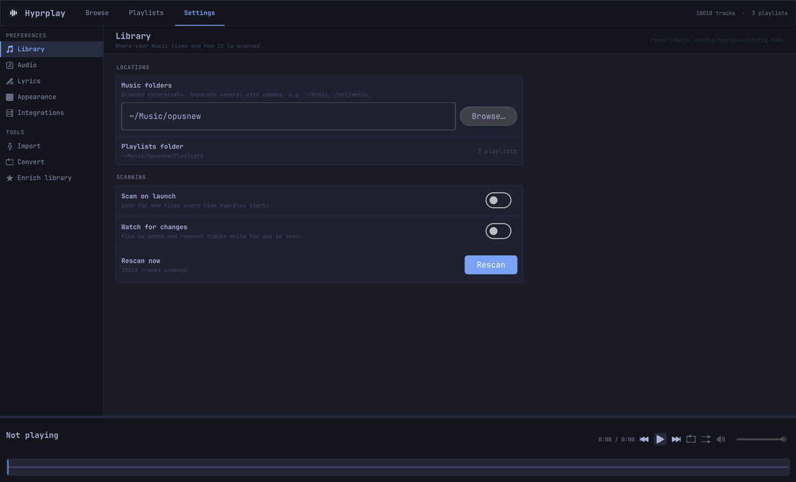

# Hyprplay


A native Qt 6 desktop music player for local libraries on Linux — built for
Omarchy/Hyprland with Wayland-first display detection, MPRIS2 integration,
synced LRC lyrics, and live Omarchy theme sync.

**Alpha v0.1.1** — usable daily driver; APIs and config keys may still evolve.

## Screenshots







## Features

- **Library browser** — artist / album / track columns with fuzzy search (`/` to open, scope follows hover); optional filesystem watch for incremental rescans
- **Formats** — FLAC, Opus, Ogg Vorbis, MP3, M4A, and AAC via TagLib + libmpv
- **libmpv playback** — queue, Fisher–Yates shuffle, repeat, gapless-friendly seeking, PipeWire/Pulse/ALSA output
- **Now playing** — waveform seek bar, album art, quality label, synced karaoke lyrics (`.lrc`)
- **Playlists** — M3U-style playlists; multi-select add; drag track numbers to reorder
- **Tag editing** — in-app editor for track, album, and artist tags via TagLib
- **Import inbox** — copy albums as-is by default; optional FLAC→Opus convert; optional beets
- **Library enrichment (optional)** — advanced whole-library Discogs pass (token required) plus title-fix review and lyrics fetch; interactive when matches are unclear
- **Secrets** — Discogs token prefers the system keyring (libsecret); fallback `secrets.toml` mode `0600`
- **MPRIS2** — `org.mpris.MediaPlayer2.hyprplay` with LoopStatus/Shuffle, Seek/SetPosition, OpenUri, and desktop media keys
- **Omarchy theme** — reads system accent/background colors and icon theme for a consistent desktop look

## Install (Arch / Omarchy)

Build from source (AUR package not published yet):

### Dependencies

```bash
sudo pacman -S qt6-base qt6-declarative mpv taglib ffmpeg libsecret
```

Optional:

- **beets** — autotag during import
- **opus-tools** — `opusenc` for Import mode “Convert FLAC→Opus”

## Build from source

```bash
git clone https://github.com/jy0un9/hyprplay.git
cd hyprplay
qmake6 hyprplay.pro
make -j$(nproc)
./hyprplay
```

Run from a terminal inside your Wayland session (Hyprland/Omarchy). The `./hyprplay` launcher discovers the Wayland socket under `$XDG_RUNTIME_DIR` when needed.

### Install prefix

Primary install is `/usr/local` (or `/usr` via the included `PKGBUILD` later):

```bash
qmake6 hyprplay.pro
make -j$(nproc)
sudo make install
```

Optional user install: `qmake6 hyprplay.pro PREFIX=$HOME/.local && make -j$(nproc) && make install`.

| Data | Location |
| --- | --- |
| Config / secrets | `~/.config/hyprplay/` (legacy `~/.config/qt-music/` is migrated on first launch) |
| Library DB | `~/.local/share/hyprplay/` |
| Playlists / music / covers | Paths in `config.toml` (default `~/Music`) |

## Tests

```bash
cd tests && qmake6 tests.pro && make -j$(nproc) && ./hyprplay-tests
```

CI also runs an offscreen QML smoke: `QT_QPA_PLATFORM=offscreen timeout 5 ./hyprplay-bin`.

## Usage

| Key | Action |
| --- | --- |
| `/`, `Ctrl+F`, `Ctrl+K` | Open library search (Browse view) |
| `Tab` (in search) | Cycle search scope (artists → albums → tracks) |
| `Space` | Play / pause (when no text field is focused) |
| `↑` / `↓` | Move in Browse or Playlists columns |
| `←` / `→` | Column focus (→ plays highlighted track) |
| `PgUp` / `PgDn` | Seek backward / forward by step |
| `W` / `A` / `S` / `D` | Same as arrows (enable in Settings → Appearance) |
| `J` / `K` | Next / previous track |
| `Enter` | Play selection |
| `Ctrl+click` / `Shift+click` | Multi-select tracks in Browse |
| `Ctrl+A` | Select all visible tracks (Browse) |
| `Delete` (playlists) | Delete playlist or remove track |
| `Ctrl+N` | New playlist |
| `Ctrl+,` | Open settings |
| `?` | Keyboard shortcut help |
| `Esc` | Close dialog / search / clear multi-select |

Settings sections: Library, Import, Audio, Lyrics, Appearance, Integrations, Enrichment.

## Configuration

Config file: `~/.config/hyprplay/config.toml`

```toml
[library]
paths = ["~/Music"]
scan_on_launch = true
library_watch = true
lyrics_dir = "~/Music/Lyrics"

[playlists]
dir = "~/Music/Playlists"

[import]
mode = "copy"             # or "convert_opus"
opus_bitrate_kbps = 256   # only used for convert_opus

[playback]
volume = 80
seek_step_secs = 5
lyrics_offset_ms = 0

[ui]
font_family = "JetBrainsMono Nerd Font"
```

Place sidecar `.lrc` files next to tracks or under `lyrics_dir`.

## Limitations (alpha)

- No “up next” queue panel (queue is internal)
- Some lyrics providers use unofficial APIs (best-effort)
- Cover art for MP3/M4A prefers folder images over embedded tags

## License

[MIT](LICENSE)
