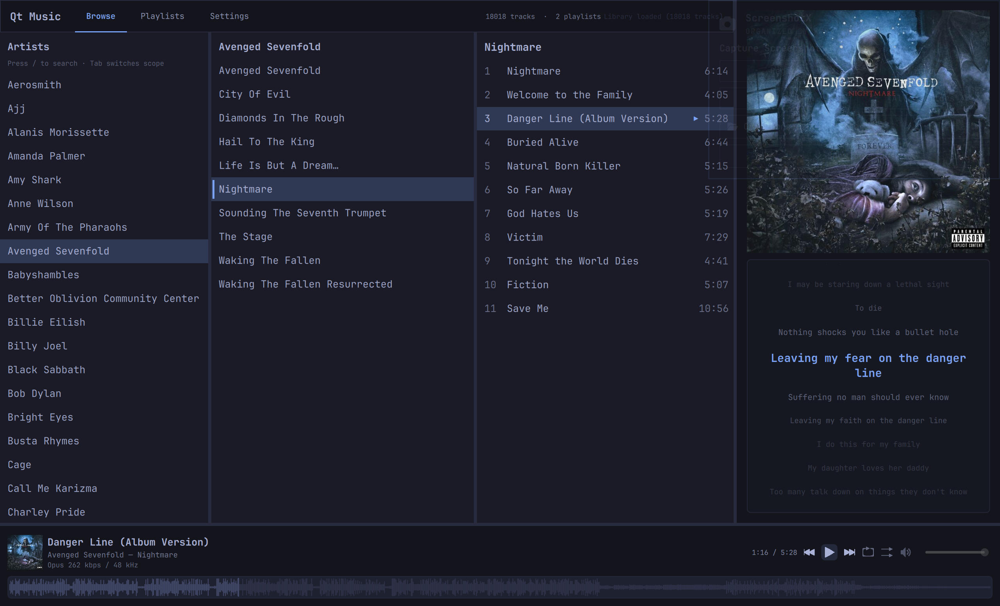

# Qt Music


A native Qt 6 desktop music player for local FLAC and Opus libraries on Linux — built for Omarchy/Hyprland with Wayland-first display detection, MPRIS2 integration, and synced LRC lyrics.

## Screenshot



> Add a screenshot at `docs/assets/screenshot.png` (recommended: 1280×800 PNG of the library view with now-playing bar visible).

## Features

- **Library browser** — artist / album / track columns with fuzzy search (`/` to open, scope follows hover)
- **libmpv playback** — queue, repeat, shuffle, gapless-friendly seeking, PipeWire/Pulse/ALSA output
- **Now playing** — waveform seek bar, album art, quality label (FLAC bit-depth / Opus bitrate), synced karaoke lyrics (`.lrc`)
- **Playlists** — create, delete, and play M3U-style playlists stored beside your library
- **Tag editing** — in-app editor for track, album, and artist tags via TagLib
- **Import inbox** — drop albums into an inbox folder, review metadata, ingest into the library
- **Discogs & beets** — fetch artist metadata from Discogs; optional beets CLI integration for autotagging
- **MPRIS2** — registers as `org.mpris.MediaPlayer2.qt-music` for desktop media keys and player applets
- **Omarchy theme** — reads system accent/background colors and icon theme for a consistent desktop look
- **Layout persistence** — sidebar collapse state and split-pane sizes saved to config across restarts

## Requirements

Arch Linux packages (adjust equivalents for your distro):

```bash
sudo pacman -S qt6-base qt6-declarative mpv taglib ffmpeg
```

Optional:

- **beet** — beets CLI for import/autotag workflows
- **libxcb-cursor** — only if you fall back to X11 and see xcb-cursor errors

## Build

```bash
git clone https://cursor.com/codebase/<your-org>/qt-music
cd qt-music
qmake6 qt-music.pro
make -j$(nproc)
./qt-music
```

Run from a terminal inside your Wayland session (Hyprland/Omarchy). The `./qt-music` launcher script discovers the Wayland socket under `$XDG_RUNTIME_DIR` when your shell did not inherit `WAYLAND_DISPLAY`.

## Install

Default install location is `~/.local` (no sudo):

```bash
qmake6 qt-music.pro
make -j$(nproc)
make install
```

Ensure `~/.local/bin` is on your `PATH`, then launch from the app menu or run `qt-music`.

System-wide install to `/usr/local`:

```bash
qmake6 qt-music.pro PREFIX=/usr/local
make -j$(nproc)
sudo make install
```

Installs:

| Path | Purpose |
| --- | --- |
| `PREFIX/lib/qt-music/qt-music-bin` | Application binary |
| `PREFIX/bin/qt-music` | Launcher (Wayland/Pulse auto-detect) |
| `PREFIX/share/applications/qt-music.desktop` | Desktop entry |
| `PREFIX/share/icons/hicolor/*/apps/qt-music.*` | App icon |

## Usage

| Key | Action |
| --- | --- |
| `/` | Open library search (Browse view) |
| `Space` | Play / pause (when no text field is focused) |
| `Esc` | Close library search |

Use the sidebar to switch between **Browse**, **Playlists**, **Import**, and **Settings**. Right-click artists, albums, or tracks in the library for tag editing and Discogs fetch.

## Configuration

Config file: `~/.config/qt-music/qt-music/config.toml`

Library database: `~/.local/share/qt-music/library.db` (loaded on startup; rescans when empty, paths change, or you click **Rescan Library**).

Example:

```toml
[library]
paths = ["~/Music"]
lyrics_dir = "~/Music/Lyrics"

[playlists]
dir = "~/Music/Playlists"

[playback]
volume = 80
seek_step_secs = 5
lyrics_offset_ms = 0   # positive = show lyrics earlier; negative = later

[layout]
sidebar_collapsed = false
sidebar_width = 208
library_artists_width = 220
library_albums_width = 240
side_panel_width = 300
now_playing_height = 108

[beets]
binary = "beet"
nomove = true

[ui]
font_family = "JetBrainsMono Nerd Font"
```

Place sidecar `.lrc` files next to tracks or under `lyrics_dir` (flat or `Artist/Album/track.lrc`).

## Project structure

```
qt-music/
├── qt-music.pro          # qmake project file
├── qt-music              # launcher script (Wayland/Pulse detection)
├── desktop/              # .desktop entry and icons
├── resources/            # Qt resource bundle (QML, assets)
└── src/
    ├── main.cpp
    ├── core/             # services (library, playback, config, import, tags, …)
    ├── models/           # QML list models
    ├── mpris/            # MPRIS2 D-Bus player
    └── ui/qml/           # Main.qml, views, components
```

## Status

Active personal project — API and config keys may change between commits. Bug reports and patches welcome.
